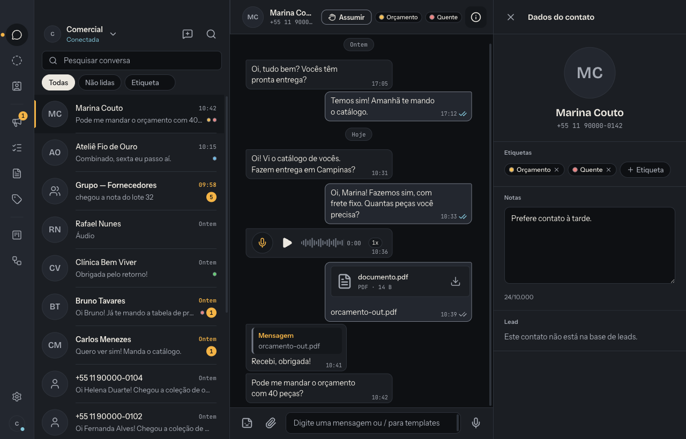
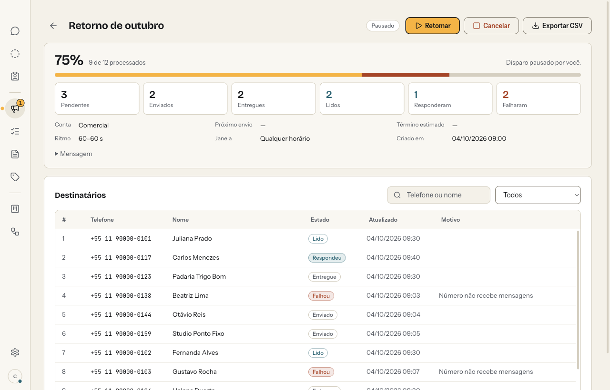
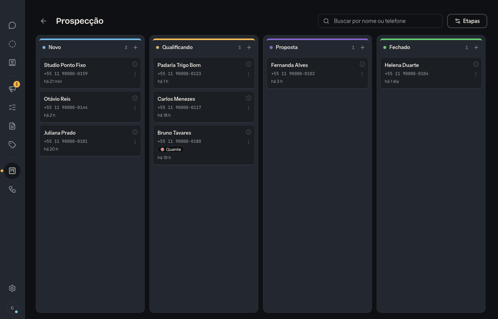
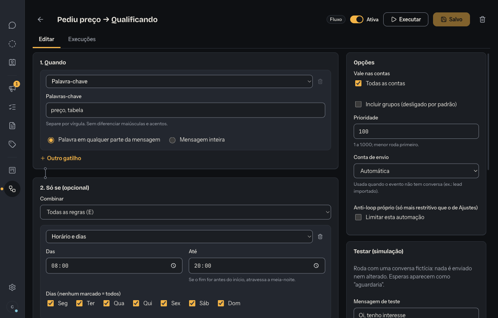

# ZapDesk

[](https://github.com/Gabriel-Almeida0/zapdesk/actions/workflows/ci.yml)
[](LICENSE)

A local, scriptable WhatsApp-compatible desktop client for macOS: several accounts in one window,
bulk sends at your own pace, a sales pipeline, automations, and an MCP server so Claude Code and
Claude Desktop can operate it for you. Everything runs on your Mac.

Website: <https://zapdesk.zyphex.site>

> **Status: early release (v0.1.0), not yet validated with a real WhatsApp account.**
> The engine, app and MCP server are covered by automated tests (Go + ~360 Node tests), but those
> run against a fake WhatsApp backend. The end-to-end check with a real number
> (`specs/001-zapdesk-mvp/quickstart.md`, task T152) is still open. Expect rough edges and please
> [open an issue](https://github.com/Gabriel-Almeida0/zapdesk/issues) when something breaks.

> **Unofficial client.** ZapDesk talks to WhatsApp through
> [whatsmeow](https://github.com/tulir/whatsmeow), an unofficial implementation of the multi-device
> protocol. It is not affiliated with, endorsed by or sponsored by WhatsApp or Meta. WhatsApp may
> restrict or ban numbers that send unsolicited messages; you are responsible for how you use it.

The interface is currently in Portuguese (pt-BR).

## Screenshots

All data in the screenshots is fictional (seeded by `app/scripts/semente-falsa.mjs`).

| Chat | Bulk send |
|---|---|
|  |  |
| **Pipeline (Kanban)** | **Automation editor** |
|  |  |

## Features

- **Multiple accounts** connected by QR code (Linked devices), one window.
- **Chat**: text, audio (record and play), images, documents, replies, labels and notes. No calls.
- **Leads**: import from CSV/XLSX, pasted lists, your contacts or MCP, normalized to E.164 and deduplicated.
- **Bulk send**: templates with variables, random interval between messages, hourly and daily
  limits, send window, pause/resume, per-recipient status and CSV export.
- **Pipelines** (Kanban), **flows** (trigger → conditions → actions), **chatbots** and
  **AI automations** written in TypeScript and run in an isolated process.
- **MCP server** with 69 tools so Claude can import leads, start sends, read and answer chats and
  build automations. See [`mcp/README.md`](mcp/README.md).

## Architecture

```
┌──────────────────────────┐      HTTP + token on 127.0.0.1      ┌───────────────────────────┐
│ app/  Electron + React   │ ───────────────────────────────────▶ │ motor/  Go engine          │
│ (UI, tray, packaging)    │                                      │ whatsmeow + SQLite         │
└──────────────────────────┘                                      │ single source of truth     │
┌──────────────────────────┐                                      │ sends, automations, API    │
│ mcp/  MCP server (stdio) │ ───────────────────────────────────▶ │                            │
│ Claude Code / Desktop    │                                      └─────────────┬──────────────┘
└──────────────────────────┘                                                    │ spawns
                                                         ┌──────────────────────▼─────────────┐
                                                         │ automacao/runner  AI automations   │
                                                         │ (isolated process, no API keys)    │
                                                         └────────────────────────────────────┘
```

| Folder | What it is |
|---|---|
| `motor/` | Go engine (whatsmeow, SQLite, local HTTP API on `127.0.0.1` with a token, `runtime.json` discovery). Starts with the app and stops when it closes. |
| `app/` | Electron + React/TypeScript desktop app; starts the engine and talks to its API. |
| `mcp/` | MCP server over stdio for Claude Code and Claude Desktop; a thin client of the engine API. Opens the app if it is closed. |
| `automacao/runner/` | Runner that executes TypeScript AI automations in a separate process. |
| `compartilhado/` | Shared packages: typed engine client and the automation SDK (`@zapdesk/automacao`). |
| `specs/`, `docs/features/` | Specs, plans, contracts and task lists that guided the build (Portuguese). |

Your conversations, leads and reports are stored locally in
`~/Library/Application Support/ZapDesk`. There is no ZapDesk server. Note that AI automations call
the Anthropic API with your own key, and the MCP server hands the conversation text you ask about
to Claude Code/Desktop.

## Install (prebuilt DMG)

Requirements: Apple Silicon (M1 or later), macOS 14+.

1. Download `ZapDesk-<version>-arm64.dmg` from
   [Releases](https://github.com/Gabriel-Almeida0/zapdesk/releases/latest).
2. Drag ZapDesk to Applications.
3. The build is **not signed with an Apple Developer ID nor notarized** (ad-hoc signature only).
   Open it once, then go to **System Settings › Privacy & Security** and click **Open Anyway**.
   Alternatively: `xattr -dr com.apple.quarantine /Applications/ZapDesk.app`.
4. Scan the QR code with your phone (WhatsApp › Linked devices).

## Build from source

Requirements: macOS on Apple Silicon, Node ≥ 22.12 (see `.nvmrc`), Go 1.27.

```bash
git clone https://github.com/Gabriel-Almeida0/zapdesk.git
cd zapdesk
npm ci
npm run dev          # compiles the Go engine and shared packages, then starts the app
```

Tests:

```bash
npm test             # all Node workspaces (app, MCP, runner, SDK, engine client)
npm run motor:testar # Go engine (unit + integration against a fake WhatsApp)
```

Package a DMG (output in `app/dist/`):

```bash
npm run empacotar
```

## Connect to Claude (MCP)

With the app installed in `/Applications`, the MCP server runs with the app's own executable, so
no separate Node install is needed.

**Claude Code**

```bash
claude mcp add -s user -e ELECTRON_RUN_AS_NODE=1 zapdesk -- \
  "/Applications/ZapDesk.app/Contents/MacOS/ZapDesk" \
  "/Applications/ZapDesk.app/Contents/Resources/mcp/zapdesk-mcp.mjs"
```

**Claude Desktop**: add this to `~/Library/Application Support/Claude/claude_desktop_config.json`
and restart Claude Desktop.

```json
{
  "mcpServers": {
    "zapdesk": {
      "command": "/Applications/ZapDesk.app/Contents/MacOS/ZapDesk",
      "args": ["/Applications/ZapDesk.app/Contents/Resources/mcp/zapdesk-mcp.mjs"],
      "env": { "ELECTRON_RUN_AS_NODE": "1" }
    }
  }
}
```

The app shows the same commands under *Ajustes › Usar com Claude*. Development setup, environment
variables and the full list of 69 tools are in [`mcp/README.md`](mcp/README.md).

## Not yet

- Notarized builds
- Windows and Linux
- English interface

## Contributing

See [CONTRIBUTING.md](CONTRIBUTING.md).

## License

[MIT](LICENSE) © 2026 Gabriel Almeida. The software is provided "as is", without warranty of any
kind.
